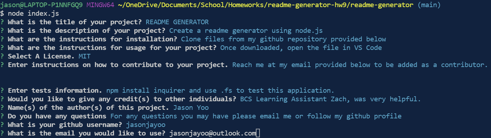

  # README GENERATOR

  (Homework-9: Node.js Professional README Generator)

   

  
  
   

  ## Description:
  Create a readme generator using node.js

   
   

  ## Table of contents:

  * [License](#license)
  * [Video](#video)
  * [Installation](#installation)
  * [Usage](#usage)
  * [Contributions](#contributions)
  * [Tests](#tests)
  * [Credits](#credits)
  * [Author](#author)
  * [Questions](#questions)

   
   
  
  ## License:
   
      -  MIT License - Copyright (c) 2022 Jason Yoo

   
   

  ## Video:

  
  
  
    
   

  ## Installation:
   
      -  Clone files from my github repository provided below

   
   
  
  ## Usage: screenshots - (Highlighted Title(s) = a hyperlink to the direct image)
   
  Once downloaded, open the file in VS Code.
   
  
[Screenshot1](images/Screenshot1.png)  "Side by side of the sample generated readme & preview - part 1"

 

[Screenshot2](images/Screenshot2.png)  "Side by side of the sample generated readme & preview - part 2"

 

[Screenshot3](images/Screenshot3.png)  "Screenshot of answering the prompted questions up to selecting license type"

 

[Screenshot4](images/Screenshot4.png)  "Screenshot of all prompted questions answered before submission"

 

[Screenshot5](images/Screenshot5.png)  "Screenshot of after submission and new readme created"

 
 

  
  ## Contributions:
   
  Reach me at my email provided below to be added as a contributor.

   
   
  
  ## Tests: 
   
  npm install inquirer and use .fs to test this application.
  
   
   

  ## Credits:
   
  BCS Learning Assistant Zach, was very helpful.

   
   

  ## Author:
   
  Jason Yoo
  
   
   

  ## Questions:
  For any questions regarding this application, you may reach me directly at jasonjayoo@outlook.com.
  
  To view my other applications, please check out my github page [jasonjayoo](https://github.com/jasonjayoo).
